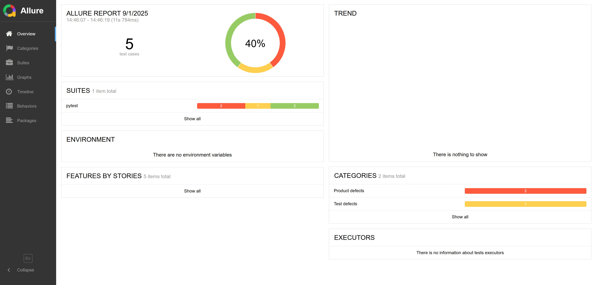

# Juice Shop Tests

Test framework (UI/AI/Security) for OWASPs Juice-Shop

## Install environment prerequisites
1. Install Python: https://www.python.org/downloads/
2. Install Docker: https://docs.docker.com/engine/install/
3. Install Java: https://www.java.com/en/download/manual.jsp
4. Install Allure: https://allurereport.org/docs/install/

## Setting Up the Application
 ```bash
 sudo docker run -d --name juice-shop -p 3000:3000 bkimminich/juice-shop
 ```

Once the container is running, the application will be available at: **[http://localhost:3000/](http://localhost:3000/)**

---
## Install prerequisites for test framework

To set up and run the project, follow these steps:

1. Install the required dependencies:
   ```bash
   pip install -r requirements.txt
   ```

2. Install Playwright browsers:
   ```bash
   python -m playwright install
   ```
---

## Running Tests

  ```bash
  pytest -n auto \
  --alluredir=allure-results \
  --clean-alluredir \
  --junit-xml=reports/test_results.xml \
  --browser firefox \
  --headed \
  --base-url=http://localhost:3000
  ```
### Command options explained:

- **`-n auto`**  
  *Enables parallel test execution using `pytest-xdist`.*  
  - `auto` automatically detects the number of available CPU cores and runs the tests in parallel using all available cores.  
  - This significantly speeds up the test execution time, especially for large test suites.
  - **Alternate Option**: Instead of `auto`, you can specify an integer (e.g., `-n 4`) to set the number of parallel workers manually.  
    - This is useful if you want to limit the number of cores being used, based on your setup.  
    - The maximum value for this number depends on the number of CPU cores available on your machine.  


- **`--alluredir`**  
  Generate Allure report in the specified directory. Folder needs to be named **allure-results**


- **`--clean-alluredir`**  
  Clean **allure-results** folder if it exists


- **`--junit-xml=path/to/junit.xml`**  
  *Generates a JUnit-style XML test report.*  
  - This option saves the test execution results in JUnit XML format, which can be used for CI/CD pipelines (e.g., Jenkins or other tools that consume JUnit reports).  


- **`--browser`**
  - **Example Values**: `firefox`, `chromium`, or `webkit`.  
  - In this command, the browser used is **Firefox**.  
  - **Default**: If not provided, Playwright uses `chromium`.  


- **`--headed`**  
  *Runs the browser in headed mode.*  
  - By default, Playwright runs tests in **headless mode** (no browser window is visible).  
  - Adding this option opens the browser window so you can visually observe the test execution.  


- **`--base-url`**  
  *Specifies the base URL for the tests.*  
  - **Example Value**: `http://localhost:3000`.  
  - The base URL is used by the test suite for relative navigation, allowing flexibility to test across different environments (e.g., local, staging, or production) without modifying the test code.

---
## Generating HTML Report

```bash
allure generate --docs-dir docs --single-file
```

Your HTML report will be available in <ins>report/index.html</ins>

**You can access the latest Allure test report [here](https://alsalexandru.github.io/juice-shop-tests/)**



 
